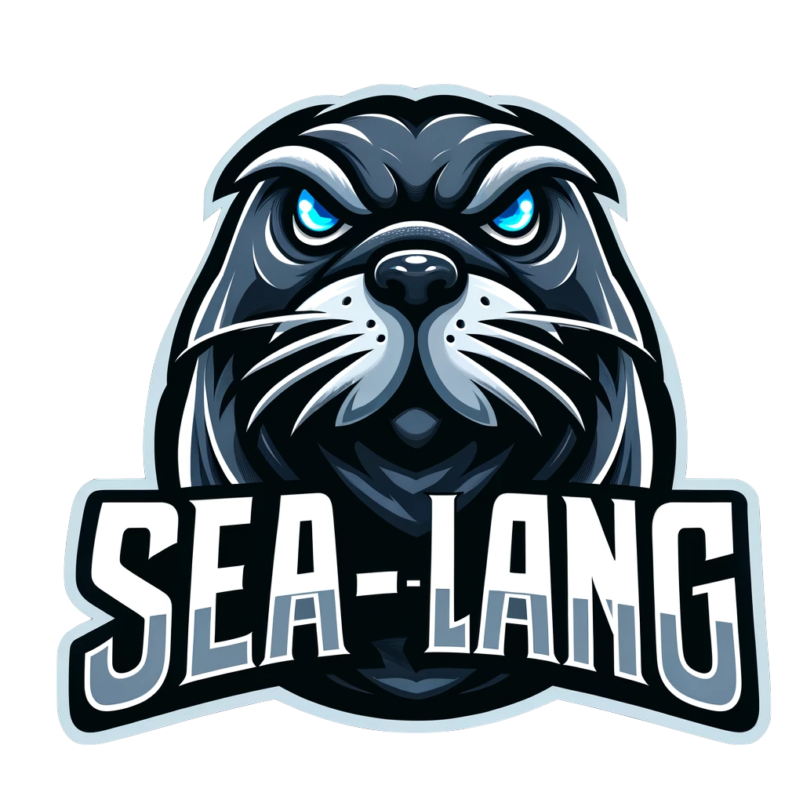

Welcome to sea-lang
===================

.. image:: https://img.shields.io/pypi/v/sea-lang.svg
   :target: https://pypi.org/project/sea-lang
   :alt: PyPI

.. image:: https://github.com/safl/sea-lang/actions/workflows/build_deploy.yml/badge.svg
   :target: https://github.com/safl/sea-lang/actions
   :alt: Build Status

.. image:: https://img.shields.io/badge/pre--commit-enabled-brightgreen?logo=pre-commit
   :target: https://github.com/safl/sea-lang/blob/main/.pre-commit-config.yaml
   :alt: pre-commit

**sea-lang** is a interface-description language for foreign-function-interface
(FFI) compilers. Created for consumption by *yace*.

* The project is hosted on `GitHUB`_

* Documentation is available at `safl.dk/sea-lang`_

**sea-lang** is an interface-definition language, 

.. _GitHUB: https://github.com/safl/sea-lang
.. _safl.dk/sea-lang: https://safl.dk/sea-lang

